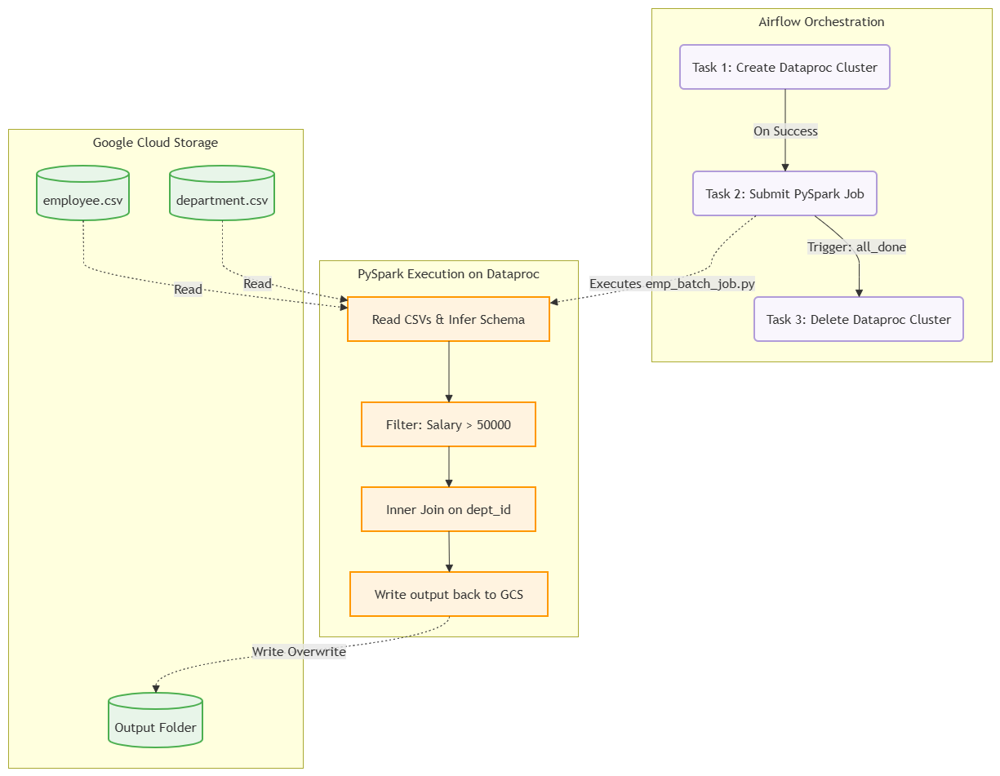
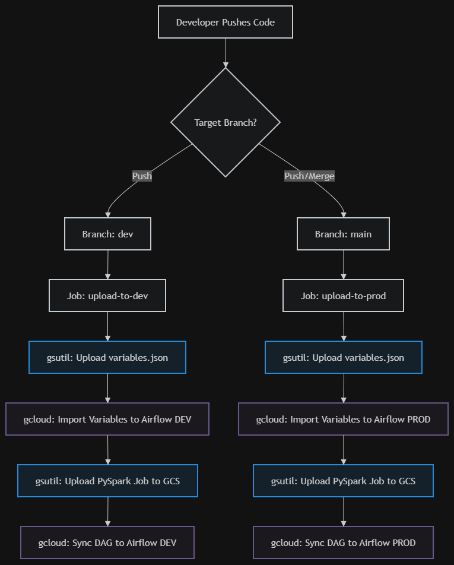

# ✈️ Flight Booking Data Pipeline: CI/CD, Airflow, Dataproc Serverless & BigQuery

This repository contains a highly advanced, fully automated Data Engineering pipeline for processing flight booking data. Moving beyond standard ephemeral clusters, this project utilizes **Dataproc Serverless** for scalable processing, **Google BigQuery** for data warehousing, and a fully automated **GitHub Actions CI/CD pipeline** to seamlessly deploy code across Development (`dev`) and Production (`prod`) environments.

## 🏗️ Architecture & Pipeline Flow

The system architecture automates everything from deployment to data warehousing:
1. **CI/CD Deployment:** GitHub Actions automatically pushes DAGs, PySpark scripts, and environment variables to the respective GCP Cloud Composer environments based on the git branch.
2. **Orchestration:** Airflow utilizes a `GCSObjectExistenceSensor` to detect new data, then triggers a Serverless Dataproc batch job.
3. **Data Transformation:** PySpark processes the raw flight data, calculates weekend indicators, categorizes lead times, calculates success rates, and generates multiple aggregated insight tables.
4. **Data Warehousing:** The transformed data and aggregations are written directly into Google BigQuery for immediate analytics and dashboarding.

### 1. High-Level Architecture

### 2. CI/CD Deployment Flow

### 3. Airflow Orchestration Flow

### 4. PySpark Transformation Flow

---

## 📁 Repository Structure

📦 03_Airflow_Flights-Booking-Project
 ┣ 📂 .github
 ┃ ┗ 📂 workflows
 ┃    ┗ 📜 cicd.yaml               # GitHub Actions CI/CD Pipeline
 ┣ 📂 01_Docs                      # Detailed code explanations & screenshots
 ┣ 📂 02_Architecture              # Architecture diagrams and flowcharts
 ┣ 📂 03_Recordings                # Local execution recordings (Git Ignored)
 ┗ 📂 04_Assets                    # Source code and datasets
    ┣ 📂 variables                 
    ┃  ┣ 📂 dev
    ┃  ┃  ┗ 📜 variables.json      # Airflow DEV environment variables
    ┃  ┗ 📂 prod
    ┃     ┗ 📜 variables.json      # Airflow PROD environment variables
    ┣ 📜 airflow_job.py            # Airflow DAG definition
    ┣ 📜 spark_transformation_job.py # PySpark ETL script
    ┗ 📜 flight_booking.csv        # Source data

## ⚙️ Cloud Setup & Prerequisites
Before triggering the CI/CD pipeline, the Google Cloud environment must be strictly configured:

### 1. GCP Infrastructure Required:

Two Cloud Composer environments (airflow-dev and airflow-prod).

Two BigQuery Datasets (flight_data_dev and flight_data_prod).

Google Cloud Storage buckets configured for raw data and Spark scripts.

### 2. IAM & Security:

A Service Account with Composer Administrator, Dataproc Worker, BigQuery Admin, and Storage Object Admin.

Organization policies updated to allow JSON key creation (for GitHub Actions authentication).

### 3. GitHub Secrets:

GCP_PROJECT_ID: Your target Google Cloud Project ID.

GCP_SA_KEY: The JSON key of your authorized service account to allow GitHub Actions to deploy code.

## 🚀 Execution Flow & Visual Walkthrough
This section documents the chronological execution of the pipeline, from CI/CD deployment to the final BigQuery tables.

### 1. Cloud Composer Environments
The pipeline targets two isolated environments: airflow-dev and airflow-prod. GitHub Actions routes the code to the correct environment based on the branch (dev or main).

### 2. Airflow DAG Execution
Once the files are pushed via CI/CD, the flight_booking_dataproc_bq_dag senses the arrival of the raw flight_booking.csv file in GCS and successfully triggers the serverless Dataproc batch.

### 3. Dataproc Serverless Execution
Unlike traditional clusters, Dataproc Serverless allocates compute dynamically. The batch job successfully executes the PySpark logic without requiring manual cluster provisioning or teardown.

### 4. BigQuery Data Warehousing
The PySpark job writes the final, transformed data directly into BigQuery.

## BigQuery Datasets:

BigQuery DEV Tables Generated:
The script automatically generates three distinct tables: origin_insights_dev, route_insights_dev, and transformed_flight_data_dev.